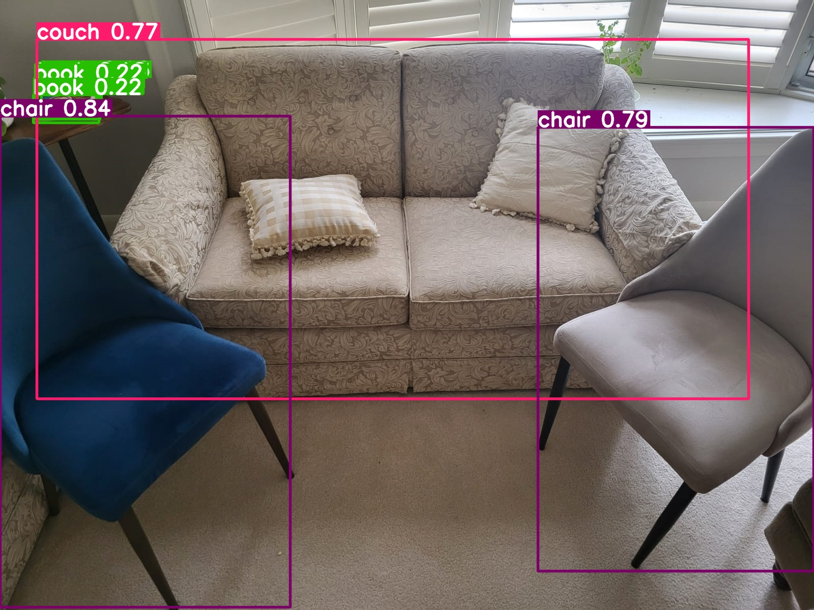
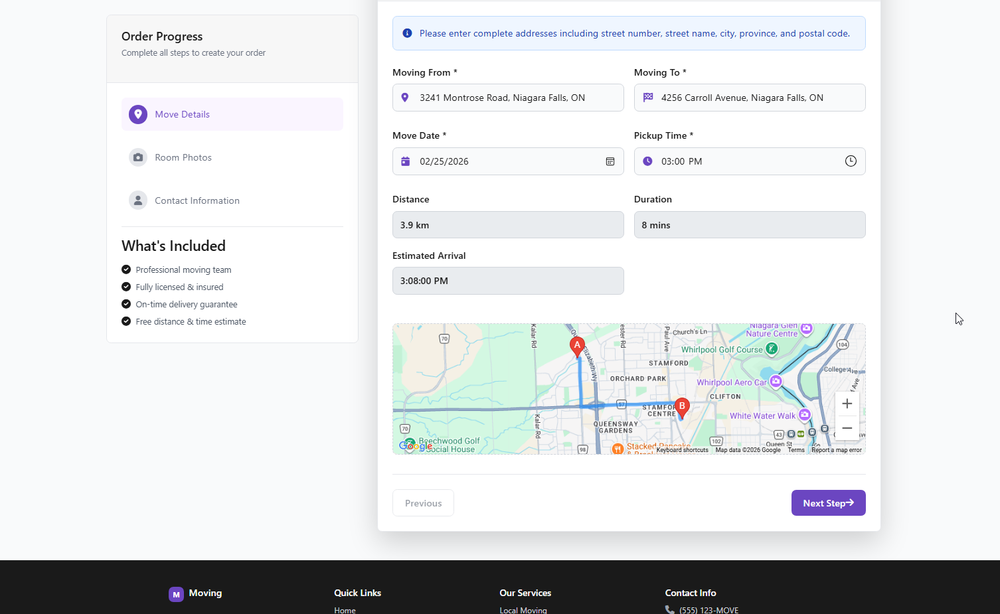
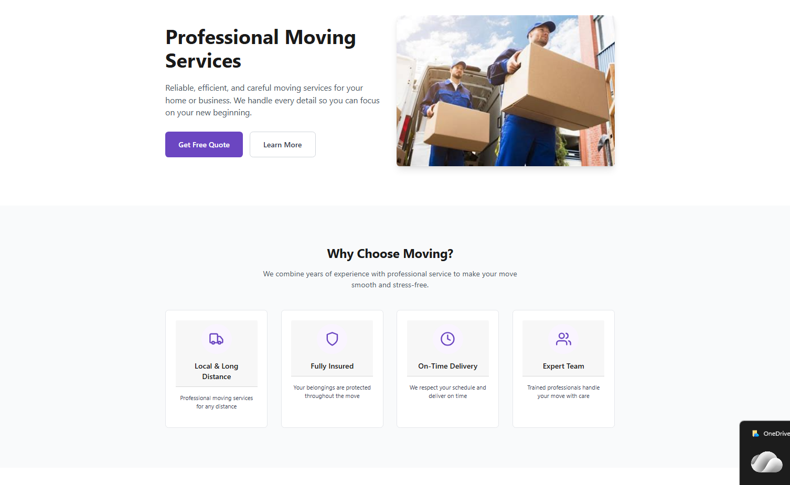

# 🚛 KostMoving - AI-Powered Logistics & Quoting Platform

## 📋 Project Overview:

KostMoving is a custom web solution developed for a local moving business to automate customer engagement and streamline the moving quote process. The project’s primary goal was to replace manual inventory assessments with an AI-driven, automated workflow.

## 🚀 The Challenge:

The client needed a way to provide accurate, real-time moving quotes based on two complex variables: the volume of items (inventory) and the travel distance. Manual estimation was slow and prone to human error.

## ✨ Key Features:
- 🤖 **AI Inventory Assessment:** Integrated a Python-based YOLO (You Only Look Once) model via a RESTful API to automatically identify and categorize household items from customer-uploaded photos.
- 📍 **Dynamic Pricing Engine:** Implemented the Google Maps API to calculate real-time, distance-based pricing and optimized routing for service requests.
- 📊 **Stakeholder Dashboard:** Built a secure administrative backend for the business owner to manage quotes, track service milestones, and communicate with clients.
- 🔐 **Secure API Management:** Implemented best practices for API versioning, monitoring, and lifecycle control to ensure the AI model and mapping services remained stable and secure.

## 🛠️ Tech Stack:
- **Frontend:** HTML, CSS, JavaScript, Bootstrap
- **Backend:** ASP.NET Core MVC (C#), Python (Flask/FastAPI for AI microservice)
- **AI/ML:** YOLO (You Only Look Once) Object Detection
- **Database:** SQLite (Entity Framework Core)
- **APIs:** Google Maps API, Custom RESTful AI API
- **Communication:** Microsoft Teams (for stakeholder delivery)

## 🏗️ System Architecture (High-Level)

- **Client Layer:** Responsive web interface for photo uploads and quote requests.
- **Logic Layer:** ASP.NET Core handles business logic and orchestrates calls to external services.
- **AI Microservice:** A standalone Python service running the YOLO model to process images and return JSON-formatted inventory data.
- **Data Layer:** SQLite manages persistent client data, quote history, and service logs.

## 📸 Screenshots & Documentation

| AI Image Recognition  | Distance-Based Quote  | Main Page  |

## 📈 Impact & Results

- **Automation:** Successfully automated the initial inventory assessment, reducing manual data entry for the client.
- **Accuracy:** Improved quote precision by using real-time distance calculations and standardized AI item recognition.
- **Service Delivery:** Maintained 100% project milestone transparency through regular stakeholder updates via Microsoft Teams.

# 📬 Contact

- 💼 Aldiyar Baibogurov
- 📧 abaibogurov@gmail.com
- 🔗 [LinkedIn](https://www.linkedin.com/in/aldiyar-baibogurov/)
