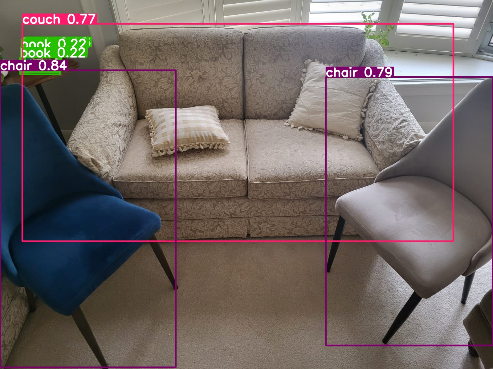
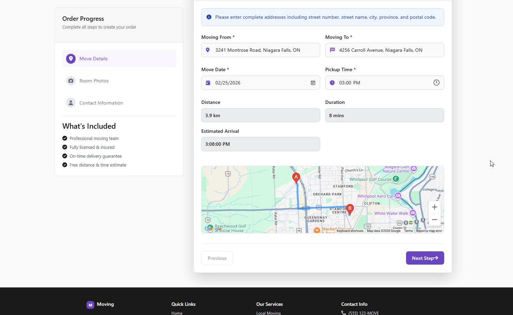
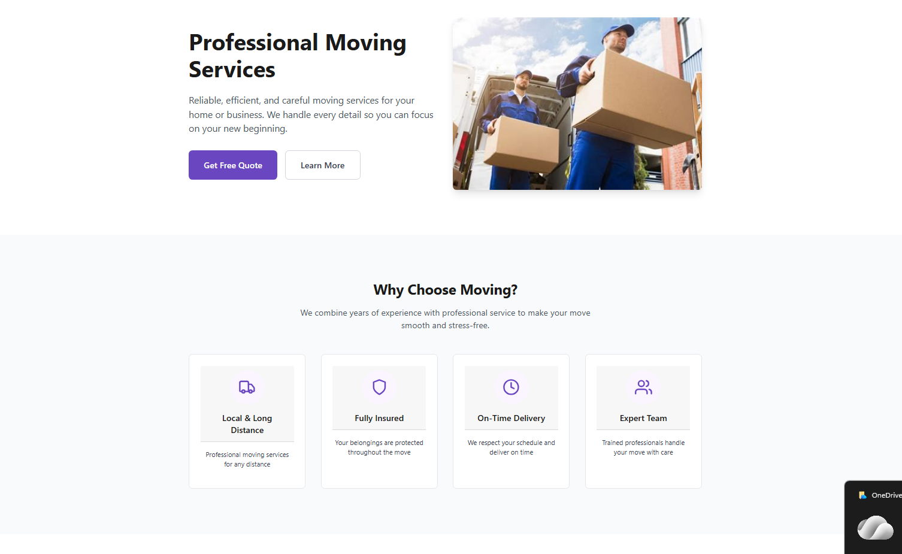

# KostMoving — AI-Powered Moving Quote Platform

A custom web solution for a local moving business that automates the quoting
process with AI-powered inventory assessment and real-time distance-based
pricing.

## What it does

The client's problem: moving quotes depend on two hard-to-estimate factors —
the volume of items being moved and the travel distance. Manual estimates were
slow and error-prone. This platform automates both.

- Customers upload photos of their items; a YOLO object-detection model
  identifies and categorizes the inventory automatically
- Google Maps API calculates travel distances in real time for accurate,
  distance-based pricing
- A private admin dashboard lets the business owner manage quotes, track
  milestones, and stay in touch with clients
- The whole thing runs as three connected pieces: a customer-facing quoting
  site, a private admin app, and a REST API linking them together

## Tech stack

- Frontend: HTML, CSS, JavaScript, Bootstrap
- Backend: C#, ASP.NET Core MVC, Entity Framework Core
- AI: Python-based YOLO object detection served as a REST microservice
- Database: SQLite
- APIs: Google Maps API, custom RESTful AI API

## How the pieces fit

- **Customer site** — photo uploads and quote requests
- **Admin app** — secure dashboard for managing quotes and operations
- **REST API** — orchestrates communication between the apps and the AI service
- **AI microservice** — standalone Python service running YOLO, returning
  JSON-formatted inventory data

## What I'd highlight

- The hardest part was the AI integration: I'd never done image recognition
  before, so I learned YOLO from scratch and figured out how to make a Python
  service talk to the C# app through a REST API — and got it working end-to-end
- Worked directly with the client to gather requirements, troubleshoot, and
  deliver from initial build through completion

## Screenshots

| **AI Image Recognition**  | **Distance-Based Quote**  | **Main Page**  |
